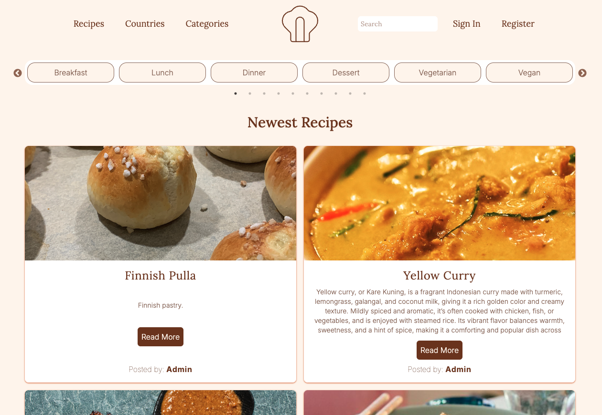
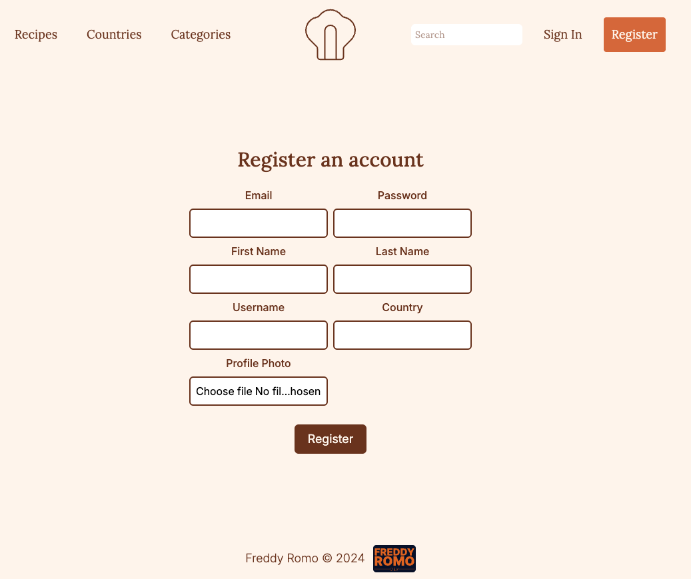

# 🍳 My Recipes

## 📌 About
**My Recipes** is a web application where users can register, log in, and manage their own recipes.  
It was built to practice **authentication, CRUD operations, and database integration** in a real project.  

---

## 🚀 Features
- User registration and login (Supabase Auth)
- Create, edit, and delete recipes
- Store data in a cloud PostgreSQL database (Supabase)
- Node.js backend hosted on **Render**
- Frontend built with **React** + **TailwindCSS**
- Navigation with **React Router**

---

## 🛠️ Stack
- **React (JavaScript)**
- **TailwindCSS**
- **React Router**
- **Node.js (backend)**
- **Supabase (Auth + DB)**
- **Deployed on Render**

---

## 📷 Screenshots

---

## 🔗 Links
- **Live site:** [recipes.freddyromo.dev](https://recipes.freddyromo.dev)  
- **Repository:** [GitHub Repo](https://github.com/FreddyRomoCH/my-recipes)  

---

## 📄 License
This project is open source and available under the [MIT License](LICENSE).
